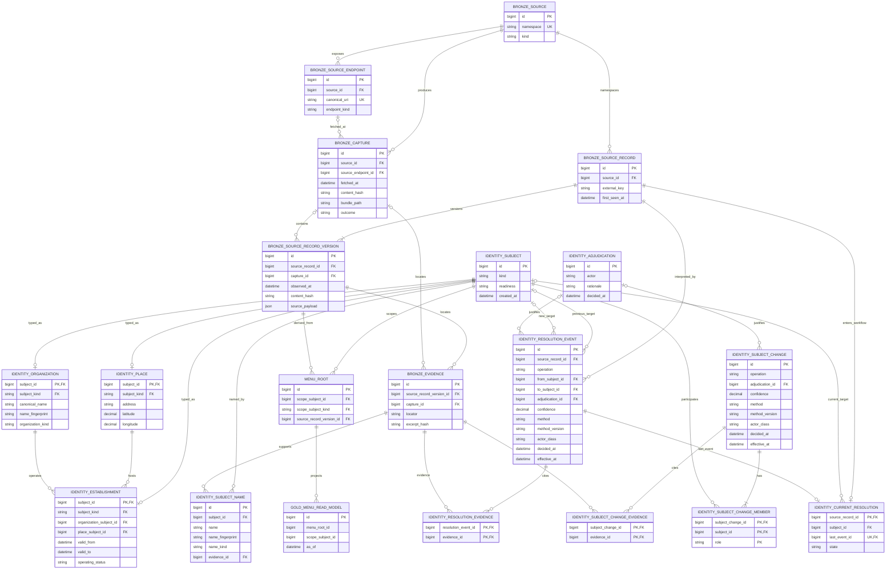

# ADR-0004 identity and provenance logical ERD

This is a logical model, not an approved migration. Names may be refined in
the schema PR, but the grains, ownership, and dependency directions are
fixed by accepted ADR-0004. `MENU_ROOT` shows only the future vertical's
dependency seam; it is not a generic offering model or a complete menu ERD.

`BRONZE_EVIDENCE` has exactly one of `source_record_version_id` or
`capture_id`. Each decision has one or more Evidence links or one immutable
Adjudication. Database constraints must also ensure that each Subject has
exactly one typed row, Establishment references typed Organization and Place
Subjects, and a menu root permits only Organization or Establishment
Subjects. Composite `(subject_id, subject_kind)` FKs enforce the typed
references against Subject's unique `(id, kind)` pair; the duplicated kind
columns are intentional constraint anchors. Resolution state requires a
Subject only when `state = 'resolved'`; `unresolved` and `needs_review` keep
an explicit null-target row. An append-only `Open` event creates the initial
`unresolved` row, so `last_event_id` is always present and the projection is
rebuildable. Subjects begin `provisional`, and vertical roots may reference
only Subjects that pass the approved identity-readiness gate.
