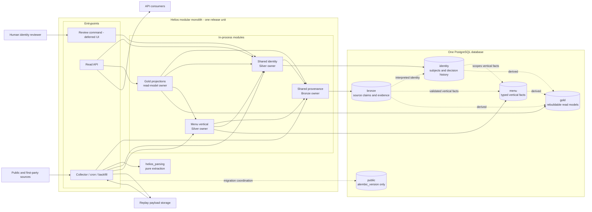

# ADR-0004 modular-monolith context

This diagram shows runtime composition and ownership. Solid arrows point from
an in-process caller to the contract or store it uses. Dashed arrows show
data lineage from Bronze through Silver to Gold; neither arrow style denotes
foreign-key direction. All modules ship from one repository and share one
Postgres transaction boundary.

The review command is an in-process entrypoint, not a service boundary. Its
UI and operational workflow are deferred; the append-only decision contract
is not.
